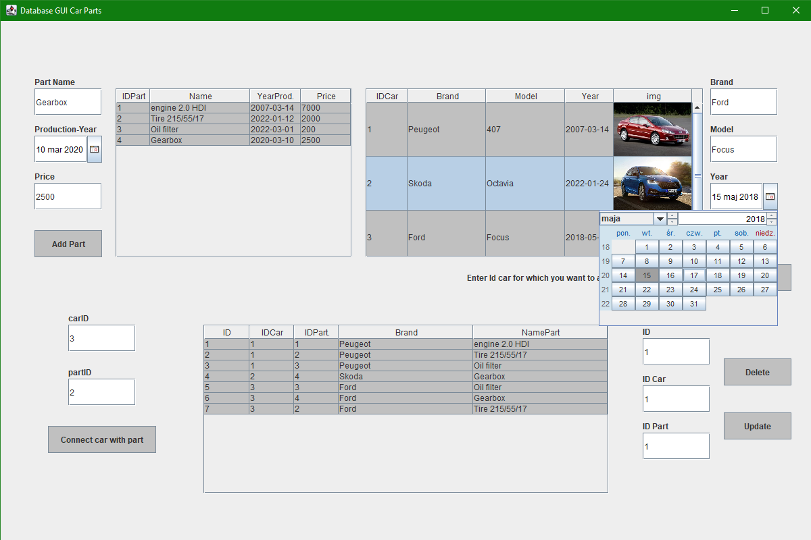

# Car-Parts
Database in PostgreSQL for connecting parts to car. This program has a connection to database, where you can save all data from the tables.  
To clone and run this program you neeed to change login and password to the database in code.  
Below a screenshot showing how it looks like

## Features:
* Adding carparts
* Adding cars (and images of them)
* Connecting parts with cars (removal and updating)
## Technologies
* Java 15 with JDBC
* PostgreSQL
